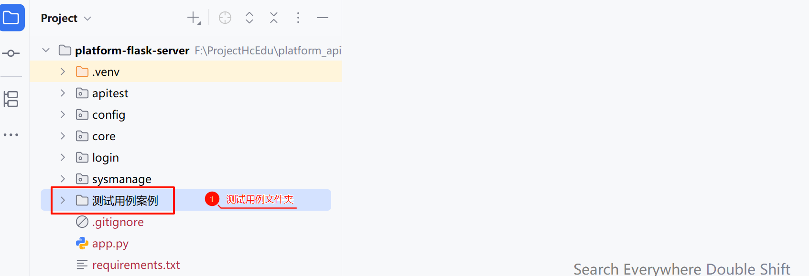
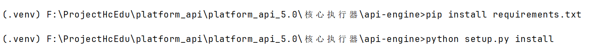
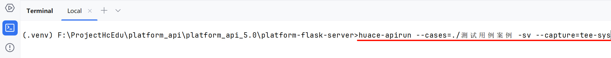
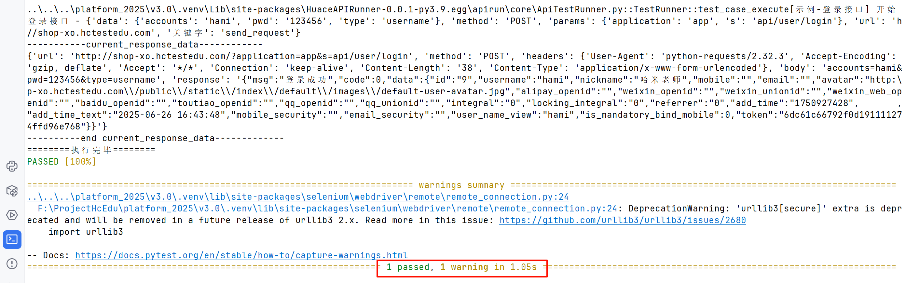

> 核心执行器怎么进行安装：如下以api-engine举例。

#### 1.  准备测试用例数据

>对应的测试用例放在：`..\核心执行器\测试用例案例`中。

**|操作步骤：**

1. 把`..\核心执行器\测试用例案例` 文件夹复制到`platform-flask-server`中

**| 说明：**

每个测试用例文件夹**需要包含两类配置**文件：

1. context.yaml（必需）
   - **唯一**存在的基础配置文件
   - 固定**名称不可修改**
   - 用于存储环境变量、全局设置等基础配置
2. 用例文件.yaml（多个）
   - 命名格式：`数字_用例名称.yaml`（如`1_登录.yaml`）
   - 执行顺序按文件名数字升序排列
   - 每个文件对应一个测试场景

比如，测试用例：`1_登录成功.yaml`

~~~yaml
desc: 示例-登录接口
steps:
- 示例-登录接口:
    关键字: send_request # 固定，其它的按照request库所支持的参数name即可
    url: http://shop-xo.hctestedu.com
    data:
      accounts: '{{username}}'
      pwd: '{{password}}'
      type: username
    method: POST
    params:
      application: app
      s: api/user/login
~~~

比如，配置文件：context.yaml

~~~yaml
username: hami
password: '123456'
~~~

#### 2.  安装核心执行器

>对应的核心执行器放在：`..\核心执行器\api-engine`中。

**|操作步骤：**

1. 打开后端项目，比如：`platform-flask-server`
2. 切换到终端到你核心执行器，比如：`..\核心执行器\api-engine`，如下图

3. 在终端执行如下两个命令

~~~shell
pip install requirements.txt
python setup.py install
~~~

#### 3. 执行用例查看运行结果

在终端输入如下命令：

~~~shell
huace-apirun --cases=用例路径 -sv --capture=tee-sys
~~~

如图：

